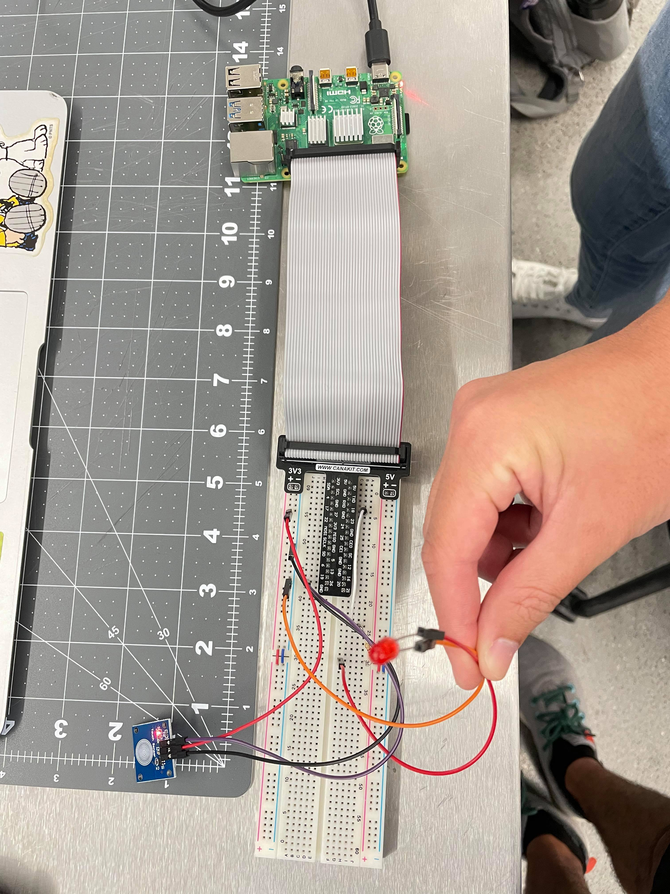
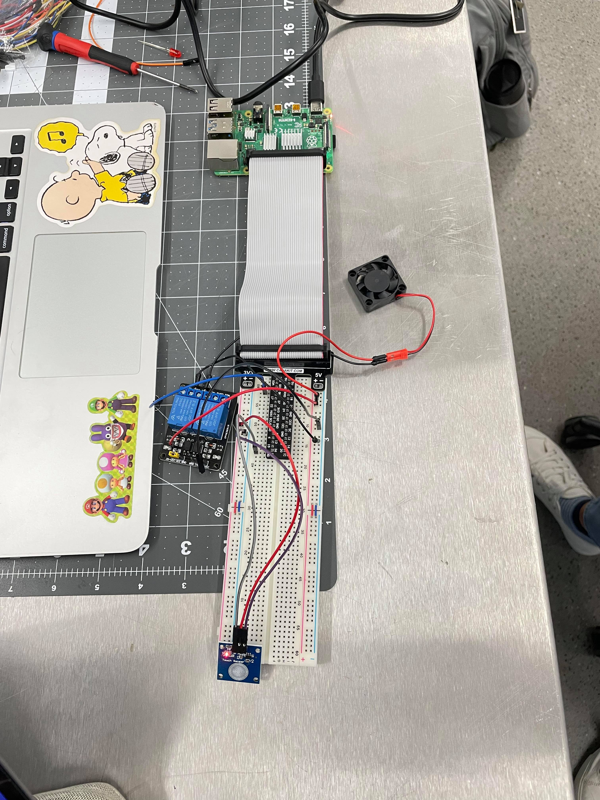
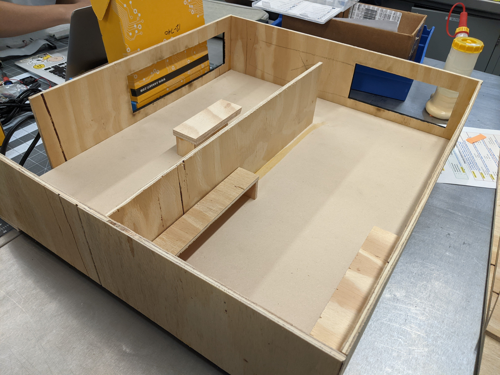

# Smart Home Automation - Sensing & Controlling
## 12740 Data Aquisition Fall 2021
Team Members: Brian Lee, Cheyu Lin, Ryan Rusali, Matt Takara

# Video Presentation with Demo
<video src="https://drive.google.com/file/d/1FEkEl8IEDGMolkugheqMs6aMYGueHD4F/view?usp=sharing" width="400"/>

# Introduction
This project demonstrates the applications of smart home technology. Using a Raspberry Pi to control a system of sensors and actuators, various functions in the home can be automated. For instance, temperature and humidity sensor can be programmed to turn on a fan when reaching a certain threshold. The benefit of automating these functions is improving both personal comfort and safety in the home. 

# Motivation
The project we set out to accomplish was the successful coding, wiring, and demonstration of a mock smart home system. We chose this project to gain a better understanding of how in-home monitoring systems could work and to gain experience setting them up ourselves. As such, our group decided to use as many sensors as possible to gain familiarity with many different sensing systems. 

# Goals
By the end of the project, we hope to create a mock smart house that can respond to environmental phenomena including fire, smoke, carbon monoxide, touch, light, temperature, humidity, and movement. We will set a threshold value for each phenomena and, if that threshold is crossed, some function within the home (buzzer, fan, etc.) will be activated in response.

# Progress Report
## Current Progress
- Built main frame of model house
- Testing sensors we are planning on using
- Creating main code file that will pull from sensor code files

Item             |  Image
:-------------------------:|:-------------------------:
LED Control w/ Touch Sensor | 
Fan Control w/ Touch Sensor & Relay | 
Smoke Sensor Testing | 
Model House | 

Highlights: In particular, articulate thing(s) you have learned / solved outside of what was taught in class

## Challenges Encountered:
- Wiring and Sensor Management: Keeping track of the GPIO pin assignments to each transducer, labeling wires and ensuring that they are connected properly, connecting transducers to appropriate voltage (3.3V or 5V), as more sensors are added to the system it becomes more difficult to keep track of
- Damaged Sensors: Incorrect wiring caused us to short circuit some of our transducers
- Code Management: Learning how to pull data from multiple sensors simultaneously. Figuring out a way to get all sensors to run in the same loop while having different refresh rates. Developing a smart way to get ensure that fans, lights, etc activate at the correct time, resolving conflicts if they receive different messages from different sensors. 
- General Troubleshooting: Trying to determine if an error is occuring due to a wiring or a coding error
- Debugging code: Understanding why a sensor is not giving an ouptut, why the controlled event is not being triggered
- Understanding how to use Github pages: Figuring out how to add images that are from the web or local, formatting content

## Future Plan - Describe what you plan to do in the next two weeks
### This Week
1. Finish testing all sensors w/ functional code
2. Wire sensors into structure - this will be especially time consuming because of the extensive wiring that will be run under the model house
3. Wire sensors to raspberry pi
4. Record live demo video
5. Start Github page report

### Next Week
1. Finish report

# Methodology
## Phenomena of Interest
The phenomena we decided to test were:
1. Fire
2. Touch
3. Light
4. Temperature/Humidity
5. Smoke
6. Carbon-monoxide

In many cases, we were less concerned about the intensity of these phenomena and were more interested in determining if it was above or below some defined threshold. For example, while we did collect temperature and humidity data, we would only return the values of True or False depending on if either the temperature or humidity were beyond some "comfortable" range. This holds true for the other sensors where we did not use their specific intensity values, but instead categorized the readings as either "good" or "bad". 

## Sensor(s) Used
Describe the sensor(s) you used, e.g. physical principles, static and dynamic behavior, and signal characteristics

Sensor             | Control |Image | Description
:-------------------------:|:-------------------------:|:-------------------------:|:-------------------------
Carbon Monoxide | Fan & Buzzer |  | <ul><li>Analog and Digital</li></ul>
DHT11 Temperature & Humidity | Fan |   | <ul><li>Digital Output</li><li>Accuracy: +/- 5% RH, +/- 2 deg C </li></ul>
Flame | LED & Buzzer |  | <ul><li>Analog and Digital Output</li><li>Working Voltage: 3.3V-5V</li><li>Sensing Range: 20cm ~ 100cm</li><li>Input: Flame/light with wavelength 760nm - 1100nm </li></li></ul>
MQ2 Smoke | Fan & Buzzer |  | <ul><li>Analog and Digital Output</li></ul>
Passive Infrared (PIR) | LED |  | <ul><li>Digital Output</li><li>Voltge: 5V-20V</li><li>TTL Voltage: 3.3V, 0V</li><li>Power Consumption: 65mA </li><li>Sensing Range: Within 120 degrees, 7m</li><li>Working Temperature: -15 ~ 70 F </ul>
Photosensitive | LED |  | <ul><li>Analog and Digital Output</li><li>Working Voltage: 3.3V-5V</li></ul>
Touch | LED |  | <ul><li>Digital Output</li></ul>

## Signal Conditioning and Processing
In order to ensure that each sensor was working as intended, we would test it before adding it to the overall system. Some of the more difficult sensors to test and implement were the smoke and carbon monoxide sensors. To test these, we figured out that cigarettes release both smoke and carbon monoxide and decided to buy some to aid in testing these sensors. For other sensors such as flame, touch, and temperature, we experimented with the sampling rate to ensure that accurate measurements could be taken. The temperature and humidity sensor, for example, was originally set up to sample at a rate of once per second. But after experimentation, we found that a delay of 5 seconds between measurements gave us the best combination of accuracy and granularity. This process was repeated for each sensor until we found the ideal sampling rate for each.

# Experiments and Results
We needed to test if each sensor used in this project was working or not. For this purpose, we needed to generate stimuli for each sensor. This became a problem for MQ2, MQ7, and flame sensor.

For MQ2 and MQ7, we had to figure out a way to generate smoke and CO safely without risking our health. According to the datasheet of these two sensors, they detect methane and CO respectively. Therefore, we bought a pack of cigarettes since that was the safe source that we were able to access that produced the two chemical stimuli. 

While testing flame sensor, we found out that the flame sensor could also be triggered by direct exposure to sunlight. Since it detects light in the 760 - 1000 nm wavelength range, and sunlight happens to fall in that range too. While we were testing flame sensor, we had to be at an indoor but ventilated space so that we didn't get false triggers or risk our lives. Therefore, we tested the flame sensor and recorded the project demonstration on the hallway that led to ANSYS hall.

When embedding the PIR sensor, we didn't really come across any problem. Instead, we had a finding that might be positive to present. We found out that when a PIR sensor is triggered, the voltage doesn't necessarily go to low instantaneously after the target gets out of the detection range, meaning that there is latency in the sensor. This didn't present a challenge to our project because we were only sensing the event of entering the house.

# Discussion
One thing our group learned from this project is that knowing how each sensor works and having a plan for how to test them is very important. In the beginning, for example our group wasn't sure how to test the smoke and carbon monoxide sensors safely. After some researching, we decided that burning cigarettes would be a good way to test both of these sensors in a safe way. From this experience, we realized that one of the most important steps in setting up sensor systems was having a way to reliably test and measure different sensors. Without this, it becomes difficult to say which part of the system is working or not working properly. 

Another problem we ran into while setting up this project was making sure that everything was wired up correctly. Because one of our goals was to use as many sensors as possible, we needed to be very organized about our wiring. This included both sautering wires together to create stronger connections and labeling each wire so we could quickly identify it in case it came loose or got disconnected. 

# References
### Code

1. Kookeye. KOOKYE Smart Home Sensor Kit for Arduino Raspberry Pi Tutorial Code https://kookye.com/2016/08/01/smart-home-sensor-kit-for-arduinoraspberry-pi/

### Pin Assignments

### Images

1. MQ7 Carbon Monoxide Sensor: https://www.twinschip.com/image/cache/catalog/Products%20Twins%20Chip%20Store%202020/Shield%20Modules/Sensors/MQ-7%20Sensitive%20Detecting%20Carbon%20CO%20Gas%20Porduct/MQ-7%20Sensitive%20Detecting%20CO%20Gas%20Twins%20Chip%201-550x550.jpg
2. DHT11 Temperature & Humidity Fan: https://www.robotshop.com/media/catalog/product/cache/image/1350x/9df78eab33525d08d6e5fb8d27136e95/d/h/dht11-temperature-humidity-sensor-module.jpg
3. Flame Sensor: https://www.pcboard.ca/image/cache/catalog/products/flame-sensor/Flame-Sensor-Module-800x800.jpg
4. MQ2 Smoke Sensor: https://img.joomcdn.net/21d689accaa9b832d434936c1b8058a4e05b16a5_original.jpeg
5. Passive Infrared PIR Sensor: https://media-cdn.seeedstudio.com/media/catalog/product/cache/b2267b506d4e4594666ef83a79896a9a/p/e/perspective_3_3.jpg
6. Photoresistive Sensor: https://osoyoo.com/wp-content/uploads/2017/09/14.jpg
7. Touch Sensor: https://imgaz3.staticbg.com/thumb/large/upload/2012/lidanpo/SKU117322%20(1).jpg

