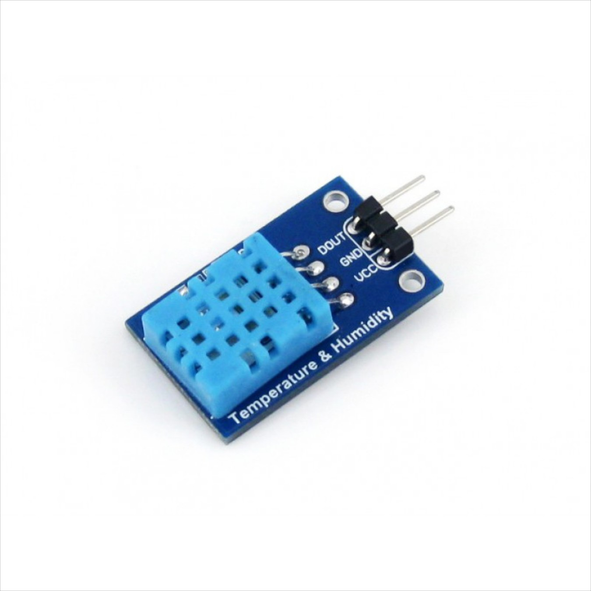

# Smart Home Automation - Sensing & Controlling
Team Members: Brian Lee, Cheyu Lin, Ryan Rusali, Matt Takara


## Welcome to GitHub Pages

You can use the [editor on GitHub](https://github.com/brianlee376/12740-Smart-Home-IoT/edit/gh-pages/index.md) to maintain and preview the content for your website in Markdown files.

Whenever you commit to this repository, GitHub Pages will run [Jekyll](https://jekyllrb.com/) to rebuild the pages in your site, from the content in your Markdown files.

### Markdown

Markdown is a lightweight and easy-to-use syntax for styling your writing. It includes conventions for

```markdown
Syntax highlighted code block

# Header 1
## Header 2
### Header 3

- Bulleted
- List

1. Numbered
2. List

**Bold** and _Italic_ and `Code` text

[Link](url) and 
```

For more details see [GitHub Flavored Markdown](https://guides.github.com/features/mastering-markdown/).

### Jekyll Themes

Your Pages site will use the layout and styles from the Jekyll theme you have selected in your [repository settings](https://github.com/brianlee376/12740-Smart-Home-IoT/settings/pages). The name of this theme is saved in the Jekyll `_config.yml` configuration file.

### Support or Contact

Having trouble with Pages? Check out our [documentation](https://docs.github.com/categories/github-pages-basics/) or [contact support](https://support.github.com/contact) and we’ll help you sort it out.




Solarized dark             |  Solarized Ocean
:-------------------------:|:-------------------------:
  |  


# Introduction
Write a brief summary of your project

# Motivation
Motivate the problem you plan to address
Why is the problem you are addressing important or interesting?

Want to create a controllable mock living space using inputs from sensors

# Goals
What are you going to achieve by the end of the project specifically?

Improve general living conditions in the model space
Comfort
Safety
Efficiency

# For Progress Report
## Current Progress
Summarize what you have done so far
Highlights: In particular, articulate thing(s) you have learned / solved outside of what was taught in class
## Problems Encountered
Articulate the problems you have encountered
This section is of the most importance in the progress report. It not only give the TA information on what help you may need, and also encourages you to think deeper about your problems.
## Future Plan
Describe what you plan to do in the next two weeks

# Methodology
## Phenomena of Interest
Describe the physical phenomena of interest, e.g. physical principles, static and dynamic behavior, and signal characteristics

Presence of fire
Touch
Light
Temperature
Smoke
Carbon-monoxide


## Sensor(s) Used
Describe the sensor(s) you used, e.g. physical principles, static and dynamic behavior, and signal characteristics

Flame sensor -> Buzzer, Slack message
Touch -> Buzzer
PIR w/ Photosensitive -> LED
Temperature -> Fan
Smoke -> Slack message
Carbon monoxide -> Slack message


## Signal Conditioning and Processing
Describe the signal conditioning and processing procedures

# Experiments and Results
Describe the experiments you did and present the results; Use tables and plots if possible

# Discussion
Discuss the insights from the project

Not knowing if the carbon monoxide sensor is working properly
Being able to link up all the sensors to the board
Are there enough pinouts on the Raspberry PI?
Getting power to all the sensors + fan
Making sure the smoke sensor doesn’t get damaged and is working properly
Designing & building the model house

